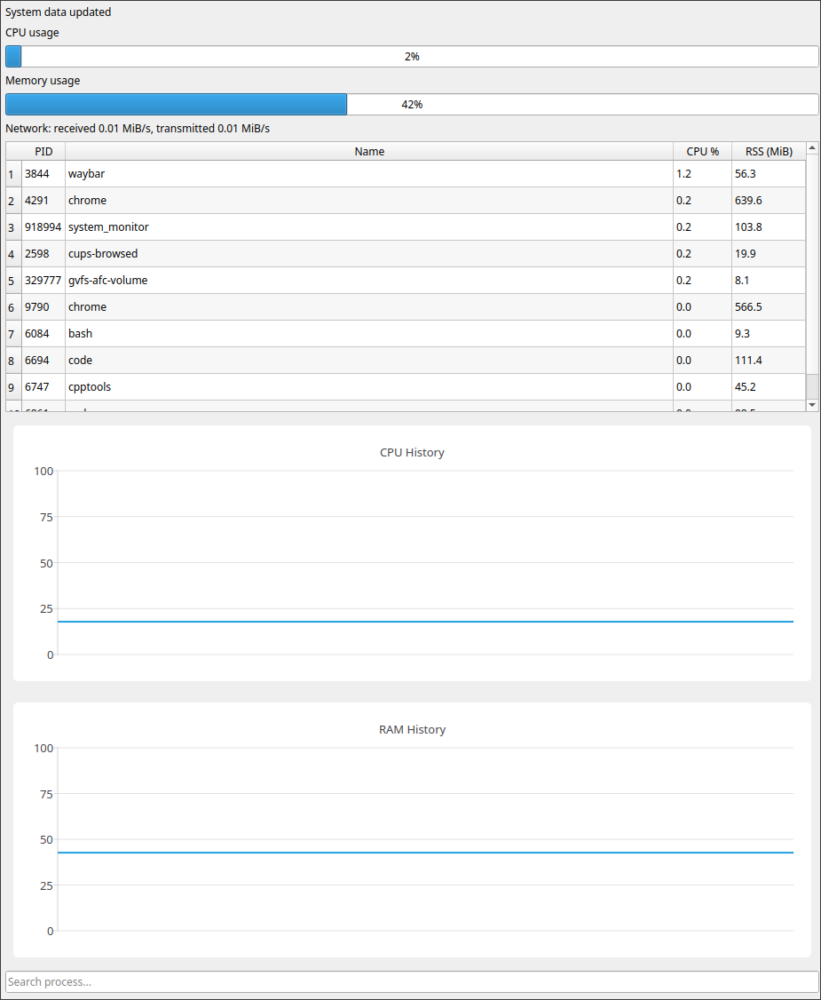

# System Monitor

A Linux desktop system monitor written in C++17 with Qt 6. It shows CPU, memory and network usage, a live list of the most active processes, and history charts.



## Features

- Overall CPU and memory usage with progress bars.
- Network receive and transmit rates (MiB/s) for all interfaces except loopback.
- Table of the 10 processes with the highest CPU usage: PID, name, CPU %, resident memory (RSS) in MiB.
- Process search by name and sorting by any column.
- CPU and memory history charts (last 60 samples).
- Context menu for processes: `SIGTERM` (terminate) and `SIGKILL` (force kill).

## Requirements

- Linux with `/proc` mounted.
- CMake 3.16 or newer.
- C++17 compiler (GCC or Clang).
- Qt 6 with Widgets and Charts modules.
- Graphical session (X11 or Wayland).

Ubuntu / Debian:

```bash
sudo apt update
sudo apt install build-essential cmake qt6-base-dev libqt6charts6-dev
```

## Build and run

```bash
cmake -S . -B build
cmake --build build -j"$(nproc)"
./build/system_monitor
```

## Usage

- Type in the search field to filter processes by name.
- Click a column header to sort the table.
- Right-click a process to send `SIGTERM` or `SIGKILL`. No confirmation is requested.
  Processes owned by other users require elevated privileges.

## How it works

`SystemMonitor` runs a worker thread that reads `/proc/stat`, `/proc/meminfo`, `/proc/net/dev` and `/proc/<pid>/{stat,status}` at a fixed interval. The result is stored as a `SystemSnapshot` protected by a mutex. The Qt main thread reads the latest snapshot with a `QTimer` and updates the widgets, so file reading never blocks the GUI.

CPU values are computed from the difference between two consecutive samples, so the first values after launch are zero. Process CPU % is relative to total CPU time of all cores: a process using one core of an 8-core machine shows about 12.5%. `top` uses a per-core scale, so its numbers differ.

## Project structure

```text
.
├── CMakeLists.txt
├── docs/
│   └── screenshot.png
├── include/
│   ├── chart_widget.hpp
│   ├── cpu_monitor.hpp
│   ├── history.hpp
│   ├── main_window.hpp
│   ├── memory_monitor.hpp
│   ├── network_monitor.hpp
│   ├── process_monitor.hpp
│   ├── system_monitor.hpp
│   └── system_snapshot.hpp
└── src/
    ├── cpu_monitor.cpp
    ├── main.cpp
    ├── main_window.cpp
    ├── memory_monitor.cpp
    ├── network_monitor.cpp
    ├── process_monitor.cpp
    └── system_monitor.cpp
```

## Limitations

- Linux only (depends on `/proc`).
- Only the top 10 processes by CPU are shown.
- Per-core CPU, disk and temperature metrics are not implemented.

## Roadmap

- Per-core CPU usage.
- Disk and temperature metrics.
- Unit tests for `/proc` parsers.
- CI build with GitHub Actions.

## License

MIT